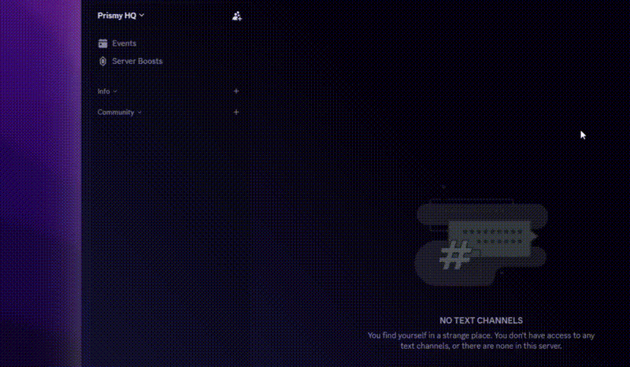

<p align="center">
  
</p>

<p align="center">
  <strong>Discord server management CLI for AI agents and humans.</strong>
</p>

<p align="center">
  <a href="https://www.npmjs.com/package/@ibbybuilds/discli"></a>
  <a href="https://github.com/ibbybuilds/discli/releases/latest"></a>
  <a href="https://github.com/ibbybuilds/discli/actions"></a>
  <a href="https://twitter.com/ibbyybuilds"></a>
</p>

<br>

Create channels, manage roles, set permissions, and control your Discord servers from the terminal.

No bot server needed. No dashboard clicking. Just commands.

> Your AI agent ([AIOS Companion](https://aioscompanion.com), [OpenClaw](https://github.com/openclaw/openclaw), Claude Code, Cursor, Codex) can use discli to manage your Discord server. Create channels, assign roles, rename everything, in seconds.

<p align="center">
  
</p>

<br>

## Why discli?

Setting up a Discord server manually is slow. Using bots for management is limited. MCP tools eat your token budget.

discli gives you direct control over Discord through simple CLI commands:

```bash
discli channel create "💬・general" --category "Community"
discli role create "Moderator" --color "#ff5733"
discli perm lock "📜・rules"
discli channel rename "old-name" "🎯・new-name"
```

One command = one API call. No bot server. No token overhead.

<br>

## 🚀 Quick Start

```bash
# Install
npm install -g @ibbybuilds/discli

# Or run directly without installing
npx @ibbybuilds/discli --help

# Setup (paste your bot token)
discli init --token YOUR_BOT_TOKEN

# Start managing
discli channel list
discli server info
```

<details>
<summary><strong>🔑 How to get a bot token</strong></summary>

<br>

1. Go to [Discord Developer Portal](https://discord.com/developers/applications)
2. Create a new application
3. Go to **Bot** > **Reset Token** > copy it
4. Go to **Installation** > set **Guild Install** scopes: `bot`, `applications.commands` with **Administrator** permission
5. Use the install link to add the bot to your server
6. Run `discli init --token YOUR_TOKEN`

> 💡 **Permissions tip:** Administrator gives discli full access, but you don't have to. You can select only the permissions you need (Manage Channels, Manage Roles, etc.). Some features won't work without specific permissions, but you stay in control of what the bot can do.

</details>

<br>

## ⚠️ Safety

**When using with AI agents:** Always review commands before approving. Destructive commands like `channel delete`, `member kick`, and `member ban` require `--confirm` but your agent may add that flag automatically. Make sure your agent setup asks for your approval before running destructive actions.

<br>

## 📖 Commands

### 🖥️ Server

```bash
discli server list              # List servers the bot is in
discli server select <id>       # Set default server
discli server info              # Server overview
discli server set --name "X"    # Change server name
discli server set --description "X"            # Set description
discli server set --verification medium        # Set verification level
discli server set --notifications only_mentions  # Default notifications
```

### 🔗 Invites

```bash
discli invite list                         # List all invites
discli invite create <channel>             # Create invite (never expires)
discli invite create <ch> --max-age 3600   # Expire after 1 hour
discli invite create <ch> --max-uses 10    # Max 10 uses
discli invite delete <code> --confirm      # Delete invite
```

### 💬 Channels

```bash
discli channel list                          # List all channels by category
discli channel create <name>                 # Create text channel
discli channel create <name> --type voice    # Create voice channel
discli channel create <name> --category Dev  # Create under a category
discli channel create "Dev" --type category  # Create a category
discli channel rename <channel> <new-name>   # Rename channel
discli channel topic <channel> "topic text"  # Set channel topic
discli channel move <channel> --category X   # Move to a category
discli channel delete <channel> --confirm    # Delete (requires --confirm)
```

### 🎭 Roles

```bash
discli role list                                       # List all roles
discli role create <name>                              # Create role
discli role create <name> --color "#e74c3c" --hoist    # With color and hoist
discli role create <name> --permissions kick_members,ban_members  # With permissions
discli role assign <role> <user>                       # Give role to member
discli role remove <role> <user>                       # Remove role from member
discli role delete <name> --confirm                    # Delete (requires --confirm)
```

### 👥 Members

```bash
discli member list                                  # List members
discli member info <user>                           # Member details
discli member nick <user> <nick>                    # Change nickname
discli member kick <user> --confirm --reason "spam" # Kick
discli member ban <user> --confirm                  # Ban
```

### 🔒 Permissions

```bash
discli perm view <channel>                             # View channel permissions
discli perm lock <channel>                             # Make read-only
discli perm unlock <channel>                           # Remove read-only
discli perm set <channel> <role> --deny send_messages  # Fine-grained control
discli perm list                                       # List permission names
```

### ✉️ Messages

```bash
discli msg send <channel> "Hello world"                # Send message
discli msg send <channel> "reply" --reply <msg-id>     # Reply to message
discli msg embed <channel> --title "X" --description "Y" --color "#5865F2"  # Rich embed
discli msg embed <channel> --title "X" --field "Name|Value|inline"          # Embed with fields
discli msg read <channel> -n 10                        # Read last N messages
discli msg edit <channel> <msg-id> "new text"          # Edit bot message
discli msg delete <channel> <msg-id> --confirm         # Delete message
discli msg react <channel> <msg-id> 👍                  # Add reaction
discli msg unreact <channel> <msg-id> 👍                # Remove reaction
discli msg pin <channel> <msg-id>                      # Pin message
discli msg unpin <channel> <msg-id>                    # Unpin message
discli msg pins <channel>                              # List pinned messages
discli msg thread <channel> "Thread Name"              # Create thread
discli msg thread <channel> "Name" --message <msg-id>  # Thread from message
```

### 📋 Audit Log

```bash
discli audit log                         # View recent audit log
discli audit log -n 50                   # Last 50 entries
discli audit log --type member_kick      # Filter by action type
discli audit log --user <id>             # Filter by who did it
discli audit types                       # List all action type names
```

<br>

## 🤖 For AI Agents

discli is designed for AI agents like [AIOS Companion](https://aioscompanion.com), [OpenClaw](https://github.com/openclaw/openclaw), Claude Code, Cursor, Codex, and others.

### How agents use it

1. 📦 Install discli globally or use npx
2. 📄 Agent reads the skill file and learns all available commands
3. ⚡ Agent runs commands and manages your server through the terminal

### Agent-friendly features

| Feature | Details |
|---------|---------|
| 📊 YAML output by default | 5x fewer tokens than JSON when piped |
| 🔢 `-n` flag | Limit results to save tokens |
| 👀 `--dry-run` | Preview changes before applying |
| ✋ `--confirm` required | Destructive commands never auto-execute |
| 🔄 Structured exit codes | `0` success, `1` error, `2` usage, `3` not found, `4` forbidden |
| 📐 SCHEMA.md | Documents output shapes for predictable parsing |
| ⚡ No MCP overhead | Zero token cost at session start |

### Install the CLI

```bash
# Install globally
npm install -g @ibbybuilds/discli

# Or run directly (no install needed)
npx @ibbybuilds/discli channel list
```

### Install the skill

```bash
# Option 1: via npx skills (if you have skills.sh)
npx skills add ibbybuilds/discli

# Option 2: copy from GitHub (works everywhere)
mkdir -p ~/.claude/skills/discli
curl -o ~/.claude/skills/discli/SKILL.md https://raw.githubusercontent.com/ibbybuilds/discli/master/skills/SKILL.md
```

> Example shown for Claude Code. Replace `~/.claude/skills/` with your agent's skill directory.

### Give your bot a personality (SOUL.md)

Your bot doesn't have to sound like a robot. discli supports a `SOUL.md` file that defines your bot's personality, tone, and quirks. When your agent sends messages or reacts as your bot, it reads this file first and stays in character.

```bash
# The agent will ask you about your bot's personality and generate this file
~/.discli/SOUL.md
```

You define things like:
- **Name and identity** -- who is your bot?
- **Tone** -- casual lowercase? formal? chaotic?
- **Personality traits** -- cheeky, helpful, sarcastic, wholesome?
- **Emoji preferences** -- which ones, how often?
- **How it talks to different people** -- owner vs community vs new members

The agent creates the file after a short conversation about what you want. Every bot gets its own voice.

> Inspired by [OpenClaw's SOUL.md](https://github.com/openclaw/openclaw) system.

### Example: agent sets up an entire server

```
You: "Set up my Discord like a dev community with channels for
      general chat, code help, AI tools, and read-only announcements"

Agent runs:
  discli channel create "Community" --type category
  discli channel create "💬・general" --category Community
  discli channel create "💻・code-help" --category Community
  discli channel create "🤖・ai-tools" --category Community
  discli channel create "📢・announcements" --category Info
  discli perm lock "📢・announcements"
```

<br>

## 🏁 Global Flags

| Flag | Description |
|------|-------------|
| `--format <yaml\|json\|table\|auto>` | Output format. Default: auto (YAML when piped, table in terminal) |
| `--server <id>` | Target a specific server instead of default |
| `-n <count>` | Limit results on list commands |
| `--dry-run` | Preview changes without applying |
| `--confirm` | Required for destructive actions (delete, kick, ban) |

<br>

## ⚙️ How It Works

discli is not a bot. It's a thin CLI wrapper around the [Discord REST API](https://discord.com/developers/docs/reference).

```
discli channel create "test"
    ↓
POST https://discord.com/api/v10/guilds/{id}/channels
Authorization: Bot {your_token}
Body: {"name": "test", "type": 0}
    ↓
Channel created. Done.
```

No WebSocket connection. No bot process. No server hosting. Your bot can be offline and commands still work.

<br>

## 🔐 Bring Your Own Bot

discli uses your bot token. You create the bot, you control the permissions, you own the data. Nothing is sent to us.

```
~/.discli/
├── config.json    # default server
└── .env           # your bot token (never leaves your machine)
```

<br>

## 📊 Comparison

| | discli | Discord MCP | discord-cli | Manual UI |
|---|---|---|---|---|
| **Purpose** | Server management | Server management | Read-only (fetch/search) | Everything |
| **Used by** | Agents + humans | Agents only | Agents + humans | Humans only |
| **Token cost** | Zero upfront | 20-40k on load | Zero upfront | N/A |
| **Create channels** | ✅ | ✅ | ❌ | ✅ |
| **Manage roles** | ✅ | ✅ | ❌ | ✅ |
| **Set permissions** | ✅ | ✅ | ❌ | ✅ |
| **Read messages** | ✅ | ✅ | ✅ | ✅ |
| **Send embeds** | ✅ | ✅ | ❌ | ✅ |
| **Self-hosted** | ✅ | ✅ | ✅ | N/A |

<br>

## 🗺️ Roadmap

- [x] Channel management (create, delete, rename, topic, move)
- [x] Role management (create, delete, assign, permissions)
- [x] Member management (list, kick, ban, nick)
- [x] Permission management (view, set, lock, unlock)
- [x] Message management (send, embed, read, edit, pin, react, thread)
- [x] Audit log
- [x] Invite management
- [x] Server settings
- [ ] Webhook management
- [ ] Scheduled events
- [ ] Automod rules
- [ ] Server templates (export/import structure)
- [ ] `discli setup` interactive guided server setup

<br>

## 📄 License

MIT

<br>

<p align="center">
  Built by <a href="https://github.com/ibbybuilds">@ibbybuilds</a>
</p>
